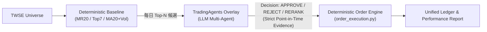

# tw_stocker 投資評估系統修訂計畫 (V2)

**架構師：** 資深量化交易架構師（Claude Opus 角色）  
**評估基準：** Codex Review (`docs/EVAL_TRADER_CODEX_REVIEW.md`, 得分 4.0/10)  
**文件路徑：** `docs/EVAL_TRADER_PLAN_V2.md`  
**狀態：** 待審批（Approved for Implementation）

---

## 一、執行摘要與設計哲學（Executive Summary）

原始計畫（V1）試圖以「重寫一個 250 行寬鬆均線腳本」來解決「MR20 與 Top-7 長期零交易」，被 Codex 評審指出三大硬傷：**存在前視偏差（Look-ahead Bias）**、**診斷誤判（混淆零訊號與零容量）**、**重複造輪子（忽視既有已測試模組）**。

本修訂計畫（V2）重新定位目標：
> **目標不是「調低門檻硬湊交易」，而是「在無前視、含真實交易成本、共用撮合與風控引擎的標準下，對 MR20、Top-7 與對照組 baseline 進行全漏斗（Funnel）量化診斷與公平評估，產出具備統計意義且可作為 TradingAgents A/B 基準的評估體系」。**

### 核心原則（遵循 Ponytail 原則）
1. **DRY（Don't Repeat Yourself）與極簡化**：不另造第三套撮合器或指標庫；完整重用 `tw_stocker` 既有的 `universe`、`order_execution`、`risk_metrics`、`benchmark` 與 `independent_sim` 帳本模型。新增程式碼總量控制在 250 行內（純函式信號 + CLI Orchestrator）。
2. **Point-in-Time 嚴格無前視**：信號計算截於 $D$ 日收盤；成交統一於 $D+1$ 開盤限價撮合；均量計算嚴格排除當日；TP/SL 以實際成交價為錨。
3. **分層可觀測性（Funnel Observability）**：區分「零訊號」、「零委託」、「零成交」與「零平倉」，精確定位策略流失瓶頸。

---

## 二、零交易問題的本質剖析與精準解法

經過深入審查 codebase 與歷史記錄，「零交易」並非單一原因，必須分類施策：

```mermaid
flowchart TD
    subgraph S1["MR20：零訊號瓶頸（Signal Starvation）"]
        A1["全市場上市普通股 (1,085 檔)"] --> A2["60日歷史 & 流動性 Top 50"]
        A2 --> A3["中期多頭 MA20>MA60"]
        A3 --> A4["順勢回檔 Close<MA20"]
        A4 --> A5["短線超賣 RSI5<=40"]
        A5 --> A6["止跌確認 Close_t > Close_t-1"]
        A6 --> A7["⚠️ RSI + Pullback 條件過窄，頻繁輸出 0 候選"]
    end

    subgraph S2["Top-7：零容量/資金鎖定（Capacity/Capital Lock-up）"]
        B1["每日多因子評分 (Top 7 候選充足)"] --> B2["部位滿載 7/7 槽位 (MAX_POSITIONS)"]
        B2 --> B3["資金消耗 > 80% (單檔部位過大 22%)"]
        B3 --> B4["持有天數達 20 天且無淘汰置換機制"]
        B4 --> B5["⚠️ 訊號被 CANCELLED_NO_CAPACITY 與 INSUFFICIENT_CASH 攔截"]
    end
```



### 1. MR20（順勢回檔）：訊號漏斗過窄
- **根因**：5 道交集門檻（流動性 $\to$ 多頭 $\to$ 回檔 $\to$ RSI $\le 40 \to$ 止跌紅 K）。在強勢多頭市場回檔不深（RSI 難到 40 以下），在弱勢空頭不符 MA20>MA60，導致候選為 0。
- **解法**：
  - **診斷先行**：重用 Phase 0 的 8-gate Funnel（`requested → valid_60d → liquid_top50 → trend → pullback → rsi → bounce → final`），在報告中精確列出卡關百分比。
  - **敏感度分析（Sensitivity Sweep）**：評估系統提供參數掃描（RSI 40 vs 45 vs 50；Pullback 容忍度），量化「放寬條件對交易頻率與勝率/報酬的邊際效應」，不隨意硬編碼修改核心定義。

### 2. Top-7（多因子動量）：部位與資金鎖死
- **根因**：訊號每日皆有產出，但由於持倉上限 7 檔、單筆部位消耗過多資金（曾達 22%）、最長持有達 20 天，且**缺乏部位汰弱留強（Turnover）機制**，導致長期滿倉而拒絕新單。
- **解法**：
  - 採納 `TURNOVER_MECHANISM_ANALYSIS.md` 的 C+D 方案：
    - 單檔部位上限調整至 7%（7 檔約佔 50% 總資金，保留 50% 現金緩衝）。
    - 導入持有期縮短（20 日 $\to$ 15 日）與動態淘汰：持倉滿 10 日且新訊號分數高於持倉標的 10% 以上時進行置換（Replacement Exit）。

### 3. 排程與時效（Schedule / Freshness）
- **根因**：過去排程未對齊交易日曆，在開盤後才產生昨日訊號，造成 `CANCELLED_EXPIRED`。
- **解法**：嚴格鎖定 $D$ 日 15:30 後產出訊號，掛單於 $D+1$ 09:00 前生效，09:30 逾期自動失效（`DAY_UNTIL_0930`）。

### 4. 監控語意分離（Observability）
- 評估報告必須徹底拆解狀態計數：
  $$\text{Universe} \xrightarrow{\text{Filter}} \text{Signals} \xrightarrow{\text{Rank}} \text{Orders} \xrightarrow{\text{Auction}} \text{Fills} \xrightarrow{\text{Manage}} \text{Open Positions} \xrightarrow{\text{Exit}} \text{Closed Trades}$$
  並將 Cancel 原因分類（`OPEN_ABOVE_LIMIT`、`NO_CAPACITY`、`INSUFFICIENT_CASH`、`EXPIRED`）。絕不可再將 `closed_trades=0` 誤判為無成交。

---

## 三、消除前視偏差（Zero Look-Ahead Guarantee）

為確保回測與實盤 100% 一致，制定嚴格的點在時間（Point-in-Time）資料時序規範：

```
[ D 日 13:30 收盤 ] 
   │
   ▼
[ D 日 15:30 盤後計算 ]
   ├─ 特徵計算：均價 MA20、Wilder RSI(5)、ATR 等（嚴格截於 D 日）
   ├─ 均量計算：volume_ratio_t = Volume_t / mean(Volume[t-20 : t-1])  <-- 嚴格排除當日
   └─ 產生訂單：掛買進限價單，Limit Price = Close_D
   │
   ▼
[ D+1 日 09:00 開盤撮合 ]
   ├─ 若 Open_{D+1} <= Limit Price (Close_D)  ──► FILLED（以 Open_{D+1} 成交）
   ├─ 若 Open_{D+1} >  Limit Price (跳空高開) ──► CANCELLED_OPEN_ABOVE_LIMIT
   └─ 若 Open_{D+1} 為 NaN / 停牌            ──► CANCELLED_NO_OPEN_PRICE
   │
   ▼
[ 持倉風控管理 (逐日 MTM) ]
   ├─ TP 門檻 = Fill_Price + 4 * ATR_D  <-- 以實際成交價為基準
   ├─ SL 門檻 = Fill_Price - 3 * ATR_D
   ├─ 同日雙觸發優先順序：SL > TP > TIME (最保守原則)
   └─ 跳空跌破 SL：以 Open_{t} 成交，不假設滑回門檻價
```

### 關鍵防前視細節：
1. **均量分母防污染**：`Volume_Ratio` 的基準均量必須使用 `.shift(1).rolling(20)`，不得包含當日爆量自身。
2. **限價開盤成交**：絕不使用 $D$ 日收盤價在 $D$ 日進場。
3. **ATR 與風控錨定**：TP/SL 必須以**實際撮合成交價（Fill Price）**計算，不可使用信號日的 Close 假定進場價。
4. **真實交易成本**：
   - 買進：手續費 $0.1425\%$
   - 賣出：手續費 $0.1425\%$ + 證券交易稅 $0.30\%$ + 賣出滑價 $0.30\%$（合計單趟出場成本 $0.7425\%$）

---

## 四、既有模組清單與重用矩陣（Reuse Matrix）

依據 **Ponytail 原則**，評估系統 90% 的重責由現有穩定、測試覆蓋完整的模組承擔，不重複編寫：

| 模組路徑 | 既有功能 | 在評估系統中的重用方式 | 是否需修改 |
|---|---|---|:---:|
| [`strategy/universe.py`](file:///root/work/tw_stocker/strategy/universe.py) | TWSE 官方 ISIN/OpenAPI 1,085 檔上市普通股清單抓取、本地 30 天快取、過濾未上市股。 | 直接呼叫 `get_twse_common_stocks()`，提供三策略統一的 Universe，消除手選選擇偏差。 | **否（原樣重用）** |
| [`strategy/order_execution.py`](file:///root/work/tw_stocker/strategy/order_execution.py) | `evaluate_buy_limit_at_open` 統一撮合純函式、7 種 `TerminalOrderStatus`。 | 所有策略的 $D+1$ 開盤限價撮合一律呼叫此模組，確保撮合語意 100% 同源。 | **否（原樣重用）** |
| [`strategy/risk_metrics.py`](file:///root/work/tw_stocker/strategy/risk_metrics.py) | `compute_risk_metrics` 計算年化報酬/波動、Sharpe/Sortino/Calmar、MDD、月度勝率、盈虧比、持有天數。 | 統一接收三策略的每日投組 Equity 與 Trades DataFrame，產出標準化指標。 | **否（原樣重用）** |
| [`strategy/benchmark.py`](file:///root/work/tw_stocker/strategy/benchmark.py) | `fetch_benchmark` 下載 0050.TW 價格曲線、計算等權基準與超額報酬（Excess Return）。 | 下載對應區間的 0050 曲線進行時間軸對齊，計算三策略對 0050 的 Excess Return。 | **否（原樣重用）** |
| [`strategy/mr20_strategy.py`](file:///root/work/tw_stocker/strategy/mr20_strategy.py) | `filter_mr20_candidates`（8-gate 診斷漏斗）、`compute_wilder_rsi`、`compute_mr20_indicators`、XTAI 交易日曆。 | 評估 MR20 策略時直接呼叫原生函式，取得 candidates 與完整的 funnel 診斷 dict。 | **否（原樣重用）** |
| [`independent_sim.py`](file:///root/work/tw_stocker/independent_sim.py) | 成熟的雙策略 Simulation Engine：Ledger 帳本、現金管理、TP/SL/TIME 逐日檢查、每日 Mark-to-Market。 | 作為回測驅動核心，或由 `eval_trader.py` 呼叫其核心回放迴圈。 | **否（原樣重用）** |

---

## 五、策略三組態定義（Strategies Evaluated）

評估系統以相同引擎同步比較三組策略：

| 策略代號 | 策略名稱 | 策略邏輯與定位 | 排序與篩選規則 |
|---|---|---|---|
| `mr20` | 順勢回檔策略 (MR20) | 原生 5-gate 策略，追求高勝率低回撤。透過漏斗診斷為何產出零訊號。 | $\text{Score} = 100 - \text{RSI}(5)$，取前 2 名，部位 45%，現金保留 10%。 |
| `top7` | 多因子動量策略 (Top-7) | 原生 AI Report 多因子評分策略，每日選股充沛。評估其在優化部位與換手後的表現。 | 多因子總分排名，取前 7 名，部位調整為 7%（配合 15 日 TIME + 置換機制）。 |
| `baseline_ma20_volume_v1` | 寬鬆均線突破 (Baseline) | **新增對照組（Sanity Check）**。低門檻動量基準，確保在任何市場週期皆有樣本。 | $\text{Score} = \text{Pct}(\text{Ret}_{20d}) + \text{Pct}(\ln(\text{Vol\_Ratio}))$，取前 5 名。 |

### 新增 Baseline (`baseline_ma20_volume_v1`) 精確定義：
- **Universe**：TWSE 上市普通股，歷史 $\ge 60$ 日，20 日均成交額位於市場前 100 名。
- **Trend 條件**：$\text{Close}_t > \text{MA20}_t$ 且 $\text{MA20}_t > \text{MA20}_{t-5}$（確保均線上揚）。
- **Volume 條件**：$\text{Volume\_Ratio}_t = \text{Volume}_t / \text{mean}(\text{Volume}_{t-20:t-1}) \ge 1.5$。
- **Score 評分**：
  $$\text{Score}_t = \text{Percentile}(\text{Return}_{20d}) + \text{Percentile}(\ln(\text{Volume\_Ratio}_t))$$
- **同分排序（Tie-break）**：`Score DESC` $\to$ `Turnover DESC` $\to$ `Ticker ASC`。

---

## 六、評估指標與輸出產物標準（Metrics & Artifacts）

### 1. 指標字典規範
- **報酬與超額**：Total Return、CAGR（年化複合成長率）、Excess Return vs 0050（明確標示為超額報酬，非 Regression Alpha）、月度勝率。
- **風險調整**：年化波動率（$\text{std} \times \sqrt{252}$）、Sharpe Ratio（年化無風險利率 0%、$N \ge 30$ 日門檻警告）、Sortino Ratio、Calmar Ratio、Max Drawdown（% 與起訖天數）。
- **交易與執行**：信號總數、掛單數、成交率（Fill Rate %）、取消原因分佈、已平倉總數、勝率、Profit Factor、平均持有天數、平均盈虧比。
- **流失漏斗（Funnel Breakdown）**：
  $$\text{Requested} \to \text{Valid Data} \to \text{Liquid Top-N} \to \text{Trend Gate} \to \text{Pullback Gate} \to \text{RSI Gate} \to \text{Bounce Gate} \to \text{Final Orders}$$

### 2. 結構化 Artifacts 輸出目錄結構
每次評估產生獨立、原子寫入的 run 目錄：

```
artifacts/eval/<run_id>/
├── manifest.json         # 執行指紋：Git commit, yfinance 版本, 區間, Universe 快照 Hash, 策略 Config
├── funnel_mr20.json      # MR20 漏斗各關卡排除數統計
├── orders.jsonl          # 每日掛單與狀態（FILLED, CANCELLED_* 及具體原因）
├── trades.jsonl          # 每筆平倉明細（進出場日、成交價、Exit Reason: TP/SL/TIME/REPLACE, 淨損益）
├── equity.csv            # 每日投組淨值、現金水位、0050 對齊淨值
├── report.json           # 機器讀取指標與 schema_version
└── report.md             # 人類可讀的高層次總結與三策略對比表
```

---

## 七、TradingAgents 整合接口規範（Phase 2 Overlay Contract）

評估系統為後續引入 TradingAgents 提供標準化 A/B 測試合約：



### 嚴格規範：
1. **嚴格防前視截斷**：LLM 檢索之新聞與資訊時間戳嚴格限制在 $\le \text{Date}_D\text{ 15:30}$，禁止讀取未來數據。
2. **輸出正規化 Schema**：
   ```json
   {
     "ticker": "2330",
     "action": "APPROVE", // APPROVE | REJECT | REDUCE
     "confidence": 0.85,
     "rationale": "營收年增顯著且外資籌碼集中",
     "evidence_cutoff": "2026-08-27T15:30:00+08:00",
     "model": "claude-3-5-sonnet",
     "token_cost_usd": 0.012
   }
   ```
3. **A/B 增量評估原則**：
   - 組 A：純量化策略（無 Agent 干預）。
   - 組 B：量化選股 + TradingAgents 覆核/過濾。
   - 評估增量：$\Delta \text{Sharpe}$、$\Delta \text{MDD}$、$\Delta \text{Win Rate}$ 以及每筆交易所耗費的 API Token 成本效益。
4. **決策不可變快照（Immutable Decision Cache）**：回測時所有 Agent 回應依 `(ticker, date, model, prompt_hash)` 進行快照快取，確保回測 100% 可重現。

---

## 八、最小可行實作架構與步驟（MVP Implementation Steps）

遵循最少新程式碼原則，整個評估系統僅需新增兩個精簡檔案：

```
tw_stocker/
├── strategy/
│   └── eval_baseline.py       # [新增] ~70 行：baseline_ma20_volume 純函式特徵與評分
├── eval_trader.py             # [新增] ~150 行：CLI 與 Orchestration 驅動器
└── tests/
    └── test_eval_trader.py    # [新增] ~100 行：Synthetic bar 防前視與撮合回歸測試
```

### 實作四步驟：

#### Step 1: 實作 `strategy/eval_baseline.py`（~70 行）
- 實作 `compute_baseline_ma20_volume_indicators(close_df, vol_df)`
- 實作 `filter_baseline_candidates(target_dt, close_df, vol_df, top_n=5)`
- 輸出標準候選格式 `{ticker, score, close, atr, rank}`

#### Step 2: 實作 `eval_trader.py` 主程式（~150 行）
- 封裝 CLI 介面：`python eval_trader.py --days 180 --strategy all --out artifacts/eval/latest`
- 透過 `strategy.universe` 載入上市普通股清單並抓取/快取 yfinance Panel 資料。
- 逐日迴圈（Chronological Simulation Loop）：
  1. 產生當日信號（MR20 / Top7 / Baseline）。
  2. 呼叫 `strategy.order_execution.evaluate_buy_limit_at_open` 進行 $D+1$ 開盤限價撮合。
  3. 依據 Fill Price 追蹤部位，執行 TP(+4 ATR) / SL(-3 ATR) / TIME / REPLACE 出場判定。
  4. 記錄 Mark-to-Market 每日權益與交易日誌。
- 調用 `strategy.risk_metrics` 與 `strategy.benchmark` 計算指標，輸出 JSON/CSV/MD 產物。

#### Step 3: 編寫 Synthetic Data 回歸測試 `tests/test_eval_trader.py`（~100 行）
- 測試案例 1：驗證 $D$ 日信號嚴格不包含 $D+1$ 資料。
- 測試案例 2：驗證跳空高開（$Open_{D+1} > Close_D$）必然觸發 `CANCELLED_OPEN_ABOVE_LIMIT`。
- 測試案例 3：驗證跳空跌破 SL 時以當日 Open 價格撮合，非門檻假定價。
- 測試案例 4：驗證同日雙觸發時 $SL > TP$。
- 測試案例 5：驗證 MR20 Funnel 8 道 Gate 統計數字完全吻合。

#### Step 4: 執行歷史資料三策略回放與基準報告
- 執行全市場 180 天歷史回放，產出 `artifacts/eval/latest/report.md`。
- 檢視 MR20 漏斗流失分佈，確認 Top-7 換手率提升後的淨值表現，完成全系統驗收。

---

## 九、驗收條件（Acceptance Criteria）

1. **無前視測試 100% 通過**：回歸測試證明無任何同日 Close 信號同日 Close 成交情境。
2. **撮合模型 100% 一致**：三策略共用 `order_execution.py`，成交、滑價與稅費無歧異。
3. **Funnel 可觀測性確認**：MR20 報告輸出每階段排除計數；Top-7 清楚列出容量與資金取消筆數。
4. **指標精確性**：報告明確區分 Excess Return 與 Alpha；小於 30 交易日或小樣本時主動標記警告。
5. **程式碼極簡**：新增代碼量不超過 250 行，無多餘抽象層，100% 重用既有模組。
6. **完全可重現**：給定相同的 `manifest.json` 與資料快照，重跑輸出結果完全一致（Deterministic）。
